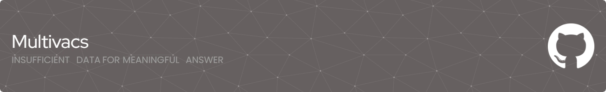

# Hi there 👋, I'm Mario
#### Data Scientist and Developer

  

I'm a data scientist with 3 years of experience in the field, working in multidisciplinary and international teams for a US multinational dedicated to agronomy and biological business. Specialized in helping business units make data-driven decisions using ETL processes, dashboards and data analysis.
Currently pursuing a Master's degree in Data Science. 

Since 2024 I write articles on [My blog](https://blog.multivacs.com) related to data science, artificial intelligence and everything that I find interest in learning and share.

## Technical Skills

 

## Currently Learning
 

## Contact me

 

